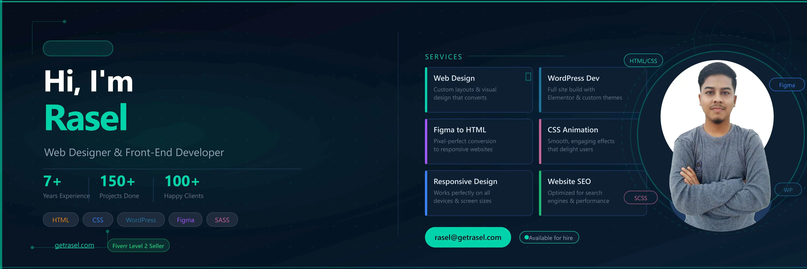

# 👋 Hey, I'm Rasel

### Designer. Developer. Problem Solver.

Building modern websites that blend design, performance, and user experience.

🌐 Portfolio: https://getrasel.com

---

## About Me

I'm Abdur Rahman Rasel, a Web Designer and Front-End Developer with 7+ years of experience creating websites that help businesses establish a stronger online presence.

My work focuses on the intersection of design and development — transforming ideas into responsive, high-performing digital experiences that look great and work flawlessly across devices.

I enjoy crafting clean interfaces, smooth animations, conversion-focused layouts, and scalable WordPress solutions that solve real business problems.

## 🛠️ Services I Offer

<table>
<tr>
<td>🌐 <b>Modern Website Design</b></td>
<td>⚙️ <b>WordPress Development</b></td>
<td>🛒 <b>Elementor Website</b></td>
</tr>

<tr>
<td>💻 <b>Front-End Development</b></td>
<td>🚀 <b>Landing Page Design</b></td>
<td>🎨 <b>UI/UX Design</b></td>
</tr>

<tr>
<td>📱 <b>Responsive Layouts</b></td>
<td>✨ <b>CSS Animation</b></td>
<td>🚀 <b>Website Optimization</b></td>
</tr>
</table>

---

### 🎨 Design

### 💻 Front-End

### 🛠️ CMS & Platforms

---

## Selected Expertise

### 🎨 Design First

Creating visually engaging interfaces that align with business goals and user expectations.

### ⚡ Performance Driven

Fast-loading websites optimized for user experience and search visibility.

### 📱 Responsive Everywhere

Mobile-first development that adapts seamlessly across all screen sizes.

### 🛠️ Custom Solutions

Tailored websites built around each project's unique requirements.

---

## 📊 By The Numbers

---

## Current Goals

* Building better WordPress experiences
* Improving UI animation workflows
* Expanding React & Next.js expertise
* Creating more conversion-focused websites

---

## Connect

  
&nbsp;&nbsp;
  
&nbsp;&nbsp;
  
&nbsp;&nbsp;
  
&nbsp;&nbsp;
  

> "A website should do more than look beautiful — it should create results."
